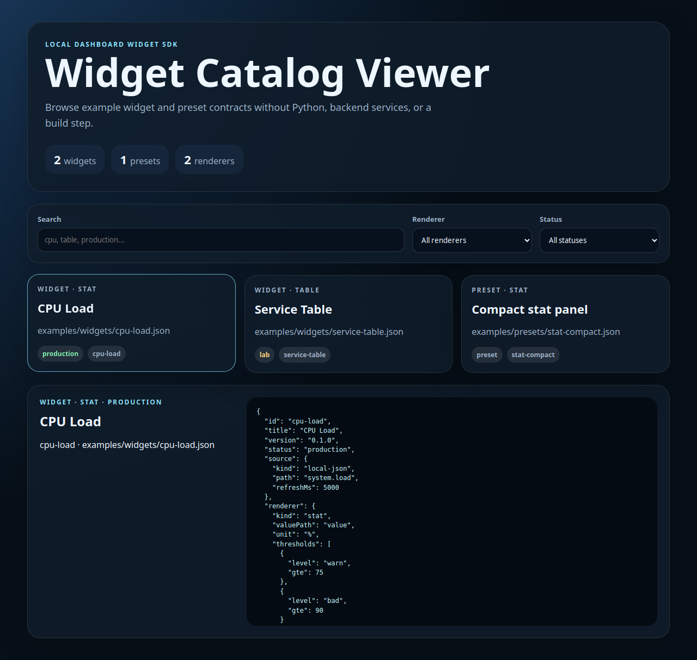

# Browser catalog viewer

The SDK includes a static browser catalog viewer for example widget and preset contracts.

Open locally:

```bash
python3 -m http.server 8766
# then open http://127.0.0.1:8766/examples/catalog-viewer/
```



## Files

```text
examples/catalog-viewer/index.html
examples/catalog-viewer/viewer.css
examples/catalog-viewer/viewer.js
examples/catalog-viewer/catalog-data.js
```

`catalog-data.js` is generated from the committed example contracts:

```bash
python3 scripts/build_catalog_viewer.py
```

## What it proves

The viewer proves that the widget/preset contracts are useful outside the Python CLI:

- static browser UI;
- no backend;
- no build step;
- no npm install;
- searchable widgets and presets;
- renderer/status filters;
- JSON contract detail panel.

## Validation

The repository quality gate verifies:

- viewer files exist;
- generated catalog data has the expected schema and examples;
- the screenshot exists and is a valid useful-size PNG;
- `viewer.js` passes `node --check` when Node is available.

## Not a replacement for production UI

This is a catalog/demo viewer, not a full dashboard builder. It is intentionally small so it can stay readable and dependency-free.
